# Auto Research with Human Review

# What

This demo shows how to run a multi-agent research process as a durable Cadence
workflow. A planner creates focused questions, a specialist agent researches
each question, and a synthesizer writes one report. The workflow then waits for
a human to revise, expand, or approve the report.

Every model invocation and tool call is a Cadence activity. Cadence records the
completed work in workflow history. If the worker restarts, the workflow
continues from the last incomplete activity instead of repeating finished work.

The search and article activities return simulated source briefs. This keeps
the demo self-contained and avoids requiring a search provider. Replace these
activities with production search and retrieval APIs when adapting the sample.

# Setup OpenAI API keys

Set the `OPENAI_API_KEY` environment variable. See
[OpenAI's API key safety guidance](https://help.openai.com/en/articles/5112595-best-practices-for-api-key-safety).

# Setup Cadence Server

Refer to step 3 of the [Python samples Quick Start](../../README.md), or run:

```bash
curl -LO https://raw.githubusercontent.com/cadence-workflow/cadence/refs/heads/master/docker/docker-compose.yml
docker-compose up --wait
```

Cadence Web is available at [http://localhost:8088](http://localhost:8088).

# Start Agent Worker

From the `python_sdk_samples` directory:

```bash
uv sync
uv run python openai_samples/auto-research/main.py
```

Approved reports are written to `python_sdk_samples/research_reports` by
default. Set `AUTO_RESEARCH_OUTPUT_DIR` to choose another directory:

```bash
AUTO_RESEARCH_OUTPUT_DIR=~/Downloads/auto-research \
  uv run python openai_samples/auto-research/main.py
```

# Trigger Agent Run

Start the workflow with the Cadence CLI:

```bash
cadence --domain default workflow start \
  --workflow_type AutoResearchWorkflow \
  --tasklist auto-research-task-list \
  --execution_timeout 3600 \
  --input '"The impact of AI on drug discovery"'
```

You can also start `AutoResearchWorkflow` from
[Cadence Web](http://localhost:8088/domains/default/cluster0/workflows). Use
`auto-research-task-list` as the task list and provide the topic as one JSON
string.

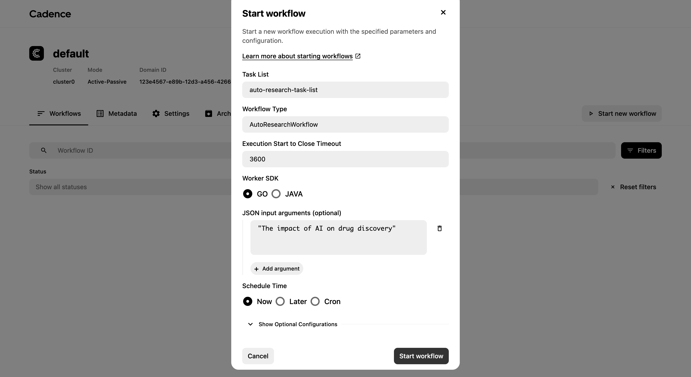

# Run the Complete Flow from the CLI

Cadence Web is optional. Keep the worker running in one terminal and use a
second terminal for the commands below.

First, assign a workflow ID. Using an explicit ID makes every later command
easy to copy:

```bash
WORKFLOW_ID="auto-research-$(date +%s)"
```

Start the research workflow:

```bash
cadence --domain default workflow start \
  --workflow_id "$WORKFLOW_ID" \
  --workflow_type AutoResearchWorkflow \
  --tasklist auto-research-task-list \
  --execution_timeout 3600 \
  --input '"The impact of AI on drug discovery"'
```

Query the current state and report draft:

```bash
cadence --domain default workflow query \
  --workflow_id "$WORKFLOW_ID" \
  --query_type get_report_draft
```

Run the query again until the status is `Waiting for human review`. The result
contains the current revision number and full Markdown report.

Request a revision:

```bash
cadence --domain default workflow signal \
  --workflow_id "$WORKFLOW_ID" \
  --name review_report \
  --input '"revise: make the executive summary shorter"'
```

Query again after the worker reports that the revised draft is ready:

```bash
cadence --domain default workflow query \
  --workflow_id "$WORKFLOW_ID" \
  --query_type get_report_draft
```

Expand the report with another specialist agent:

```bash
cadence --domain default workflow signal \
  --workflow_id "$WORKFLOW_ID" \
  --name review_report \
  --input '"expand: recent advances in clinical trials"'
```

Query again after the additional research finishes:

```bash
cadence --domain default workflow query \
  --workflow_id "$WORKFLOW_ID" \
  --query_type get_report_draft
```

Approve and publish the final report:

```bash
cadence --domain default workflow signal \
  --workflow_id "$WORKFLOW_ID" \
  --name review_report \
  --input '"approve"'
```

Inspect the workflow history and confirm that it completed:

```bash
cadence --domain default workflow show \
  --workflow_id "$WORKFLOW_ID"
```

The worker prints the absolute path of the published Markdown file. If you used
the output directory from the worker example, list the finished reports with:

```bash
ls -lt ~/Downloads/auto-research
```

# View Research Progress

Open the workflow in Cadence Web and select **History**. The first events show
the workflow input, the planning model call, and the progress activity.

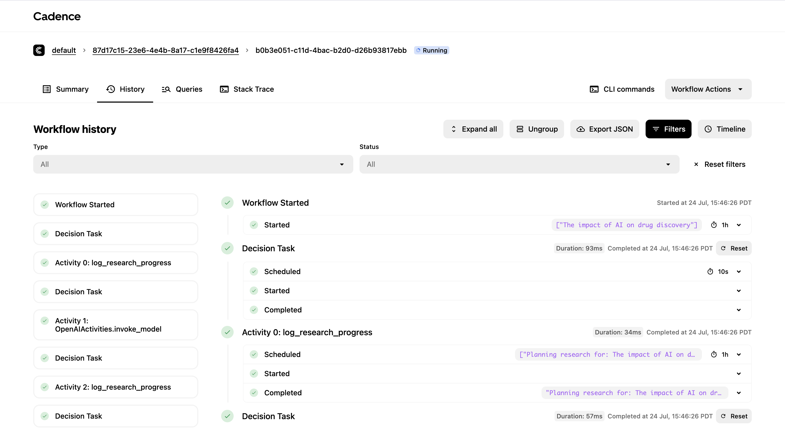

The planner creates four questions. Each question is assigned to a specialist
agent. The history shows model calls and source tool activities with their
inputs and results.

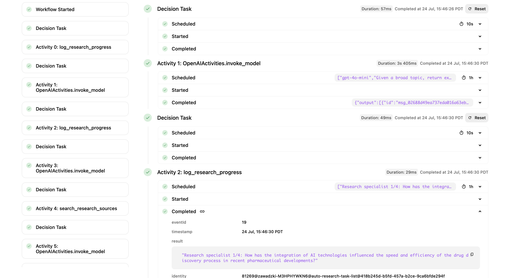

After all four specialists finish, the synthesizer writes the first report.
The workflow records that draft round 0 is ready and waits for a human signal.

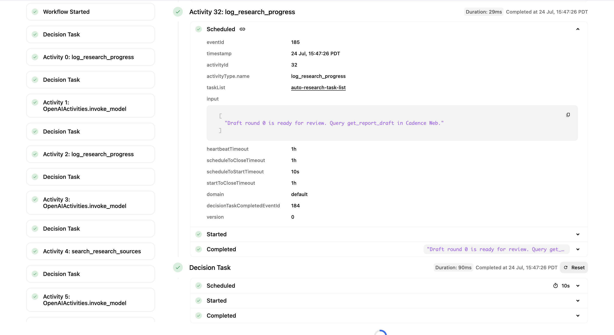

# View Initial Report

Open **Queries** and run `get_report_draft`. The query returns the current
report without changing workflow state.

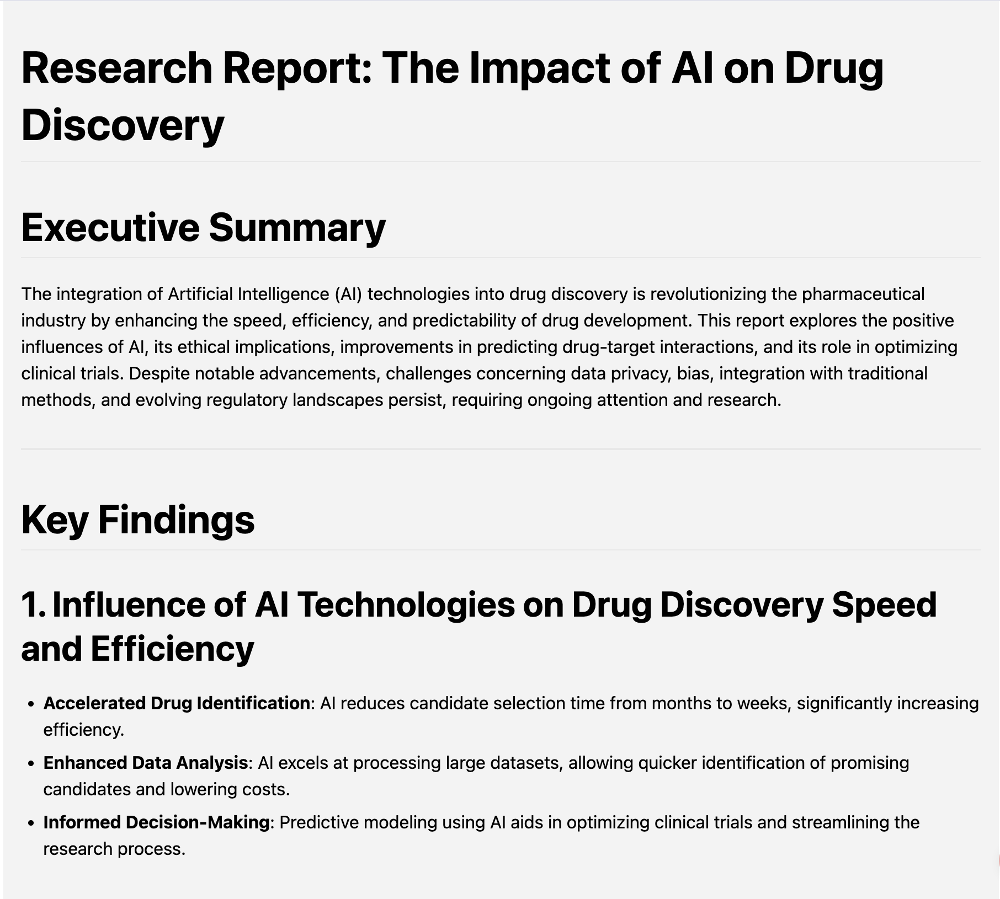

Query results are a view of durable workflow state. If you leave the Queries
tab, run `get_report_draft` again to display the same report.

Use **Workflow Actions**, then select **Signal** to send a review decision.

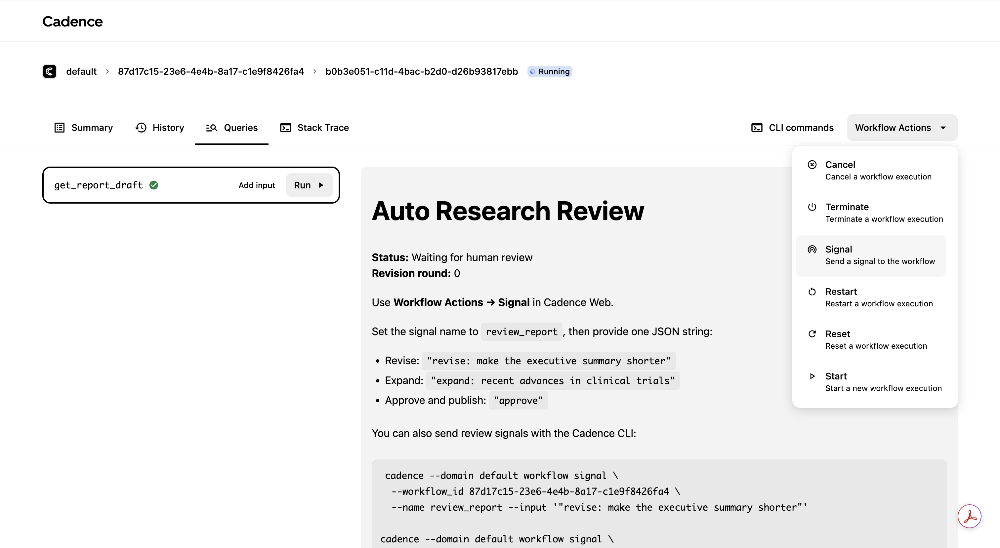

# Request Revision

Use `review_report` as the signal name. The input must be one JSON string. This
example asks the editor agent to shorten the executive summary.

```json
"revise: make the executive summary shorter"
```

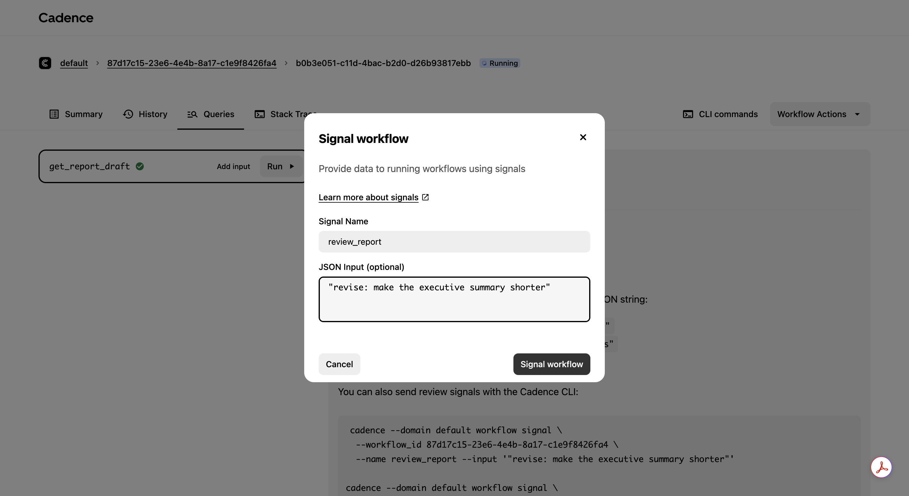

The signal and all work caused by it are visible in workflow history. Cadence
records the request, the editor model invocation, and the new draft.

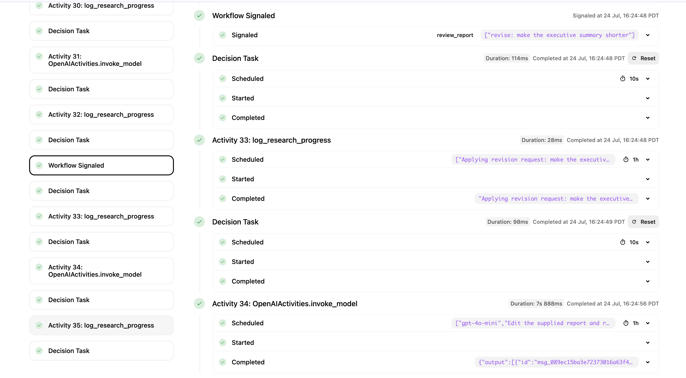

The worker also reports when it starts the edit and when the revised draft is
ready.

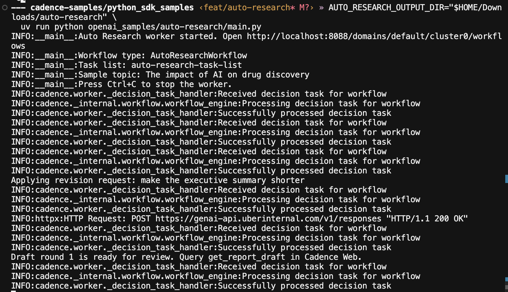

Run `get_report_draft` again. The query now shows revision round 1 and the
updated report.

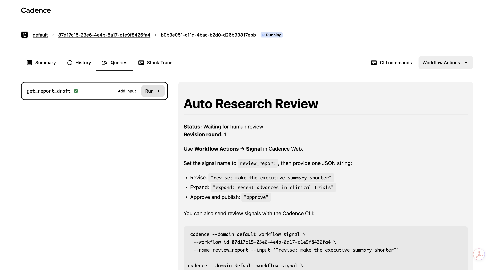

You can send the same revision from the CLI:

```bash
cadence --domain default workflow signal \
  --workflow_id <workflow-id> \
  --name review_report \
  --input '"revise: make the executive summary shorter"'
```

# Expand Research

Send another `review_report` signal to add a new research topic:

```json
"expand: recent advances in clinical trials"
```

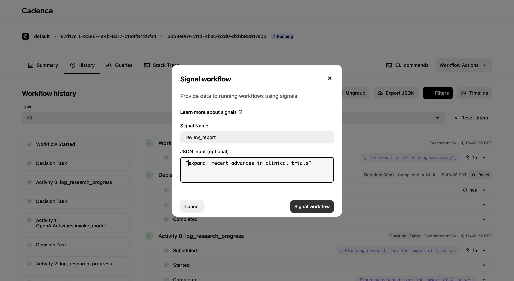

The workflow increments the revision round and starts another specialist
agent. The query shows the expansion in progress while the previous report
remains available.

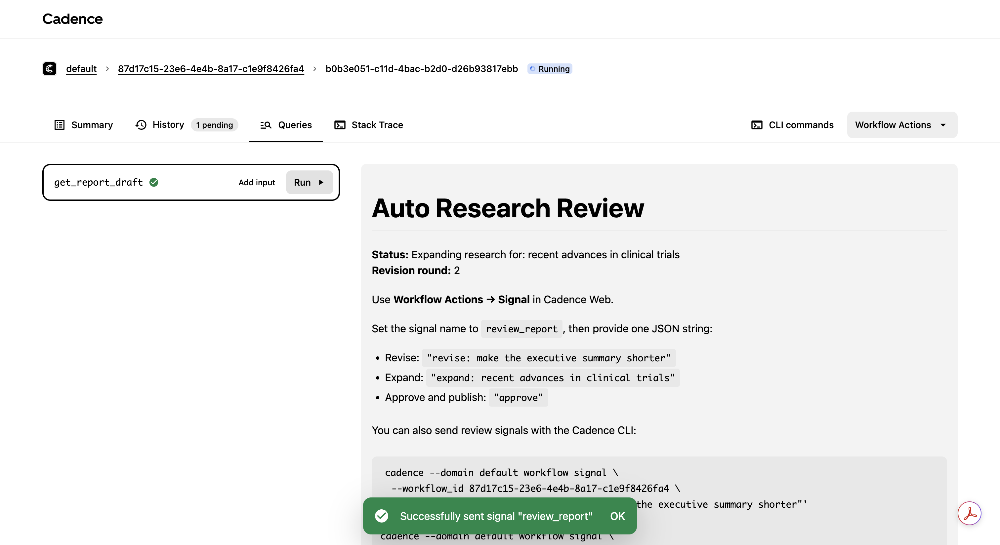

After the specialist and editor finish, run `get_report_draft` again. The same
report now contains the new clinical trials research.

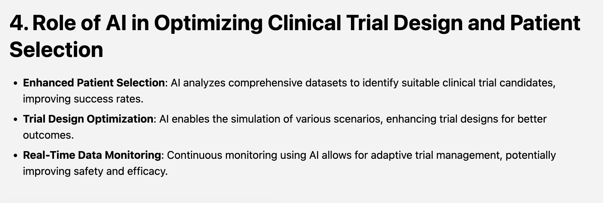

You can send the expansion from the CLI:

```bash
cadence --domain default workflow signal \
  --workflow_id <workflow-id> \
  --name review_report \
  --input '"expand: recent advances in clinical trials"'
```

# Approve and Publish

When the report is ready, send one final `review_report` signal:

```json
"approve"
```

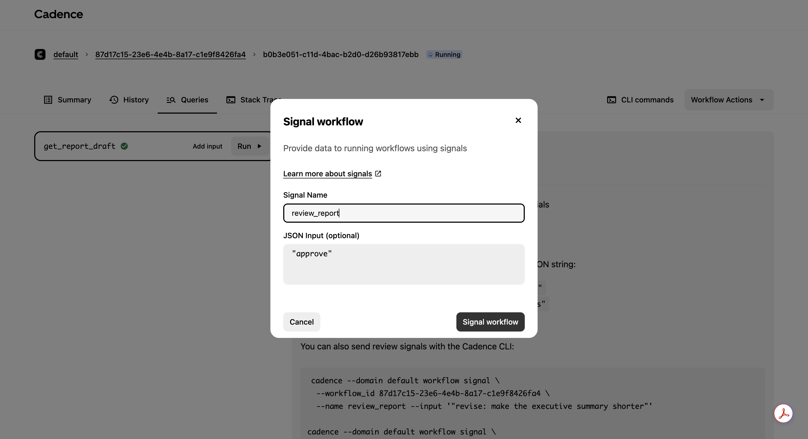

The `publish_research_report` activity writes the full Markdown report to the
configured output directory. The query shows the saved path and final revision
number.

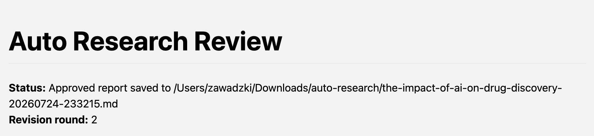

Cadence records the publish activity, the final progress activity, and workflow
completion.

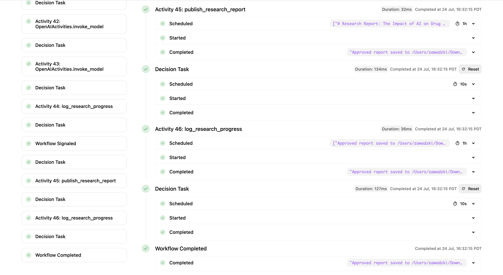

The workflow summary shows the original topic, final status, and saved report
path.

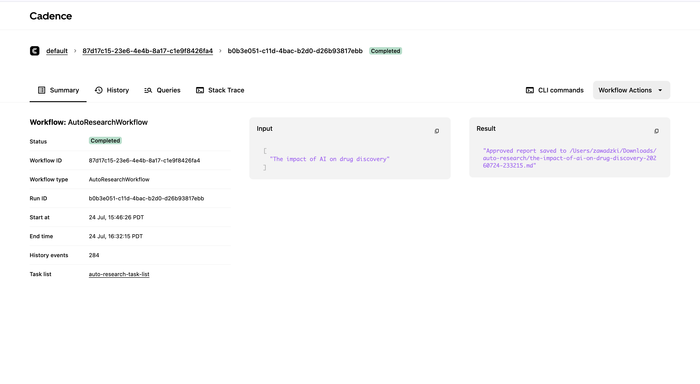

# Test Durable Recovery

Stop the worker while research or editing is in progress, then restart it with
the same worker command. Cadence replays the recorded history and continues
from the last incomplete activity. Completed model calls and tool calls do not
run again.
